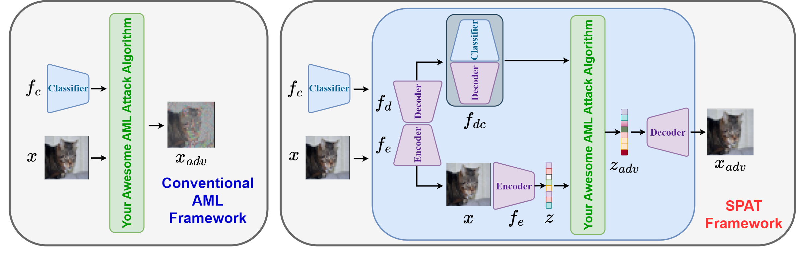
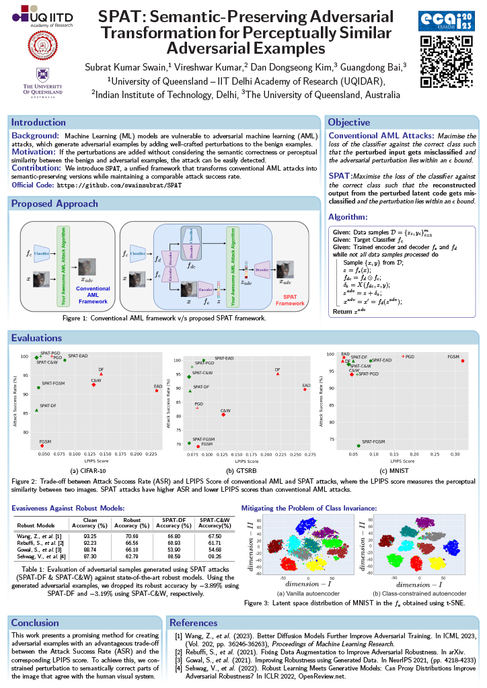

<section class="hero">
<!-- <div class="hero-body"> -->
<div class="container is-max-desktop">
<div class="columns is-centered">
<div class="column has-text-centered">

<div class="approach-img">
                
</div>

</div>
</div>
</div>
<!-- </div> -->
</section>

<!-- Using HTML to center the abstract -->
<div class="columns is-centered has-text-centered">
    <div class="column is-four-fifths">
        <h2>Abstract</h2>
        <div class="content has-text-justified">
        Although machine learning models achieve high classification accuracy against benign examples, they are vulnerable to adversarial machine learning (AML) attacks which generate adversarial examples by adding well-crafted perturbations to the benign examples. The perturbations can be increased to enhance the attack success rate, however, if the perturbations are added without considering the semantic or perceptual similarity between the benign and adversarial examples, the attack can be easily perceived/detected. As such, there exists a trade-off between the attack success rate and the perceptual similarity. In this paper, we propose a novel Semantic-Preserving Adversarial Transformation (SPAT) framework which facilitates an advantageous trade-off between the two metrics. SPAT modifies the optimisation objective of an AML attack to include the goal of increasing the attack success rate as well as the goal of maintaining the perceptual similarity between benign and adversarial examples. Our experiments on a variety of datasets including CIFAR-10, GTSRB, and MNIST demonstrate that SPAT-transformed AML attacks achieve better perceptual similarity while maintaining the attack success rates as the conventional AML attacks.
        </div>
    </div>
</div>

<div class="columns is-centered has-text-centered">
<div class="column is-four-fifths">
<h2 class="title is-3" style="margin-top: 20px;">Poster</h2>
</div>
</div>
<div class="approach-img">
    
</div>


---

<!-- > Note: This is an example of a Jekyll-based project website template: [Github link](https://github.com/shunzh/project_website).\
> The following content is generated by ChatGPT. The figure is manually added. -->

<!-- ## Background
The paper "On Computable Numbers, with an Application to the Entscheidungsproblem" was published by Alan Turing in 1936. In this groundbreaking paper, Turing introduced the concept of a universal computing machine, now known as the Turing machine.

## Objective
Turing's main objective in this paper was to investigate the notion of computability and its relation to the Entscheidungsproblem (the decision problem), which is concerned with determining whether a given mathematical statement is provable or not.


## Key Ideas
1. Turing first presented the concept of a "computable number," which refers to a number that can be computed by an algorithm or a definite step-by-step process.
2. He introduced the notion of a Turing machine, an abstract computational device consisting of an infinite tape divided into cells and a read-write head. The machine can read and write symbols on the tape, move the head left or right, and transition between states based on a set of rules.
3. Turing demonstrated that the set of computable numbers is enumerable, meaning it can be listed in a systematic way, even though it is not necessarily countable.
4. He proved the existence of non-computable numbers, which cannot be computed by any Turing machine.
5. Turing showed that the Entscheidungsproblem is undecidable, meaning there is no algorithm that can determine, for any given mathematical statement, whether it is provable or not.


*Figure 1: A representation of a Turing Machine. Source: [Wiki](https://en.wikipedia.org/wiki/Turing_machine).*

## Table: Comparison of Computable and Non-Computable Numbers

| Computable Numbers | Non-Computable Numbers |
|-------------------|-----------------------|
| Rational numbers, e.g., 1/2, 3/4 | Transcendental numbers, e.g., π, e |
| Algebraic numbers, e.g., √2, ∛3 | Non-algebraic numbers, e.g., √2 + √3 |
| Numbers with finite decimal representations | Numbers with infinite, non-repeating decimal representations |

He used the concept of a universal Turing machine to prove that the set of computable functions is recursively enumerable, meaning it can be listed by an algorithm.

## Significance
Turing's paper laid the foundation for the theory of computation and had a profound impact on the development of computer science. The Turing machine became a fundamental concept in theoretical computer science, serving as a theoretical model for studying the limits and capabilities of computation. Turing's work also influenced the development of programming languages, algorithms, and the design of modern computers. -->

## Citation
```
@article{swain2023although,
    title     = {SPAT: Semantic-Preserving Adversarial Transformation for Perceptually Similar Adversarial
                 Examples},
    author    = {Subrat Kumar Swain and Vireshwar Kumar and Dan Dongseong Kim and Guangdong Bai},
    booktitle = {ECAI 2023 - 26th European Conference on Artificial Intelligence, September 30 - October 4,
                 2023, Kraków, Poland - Including 12th Conference on Prestigious Applications of Intelligent
                 Systems (PAIS 2023)},
    series    = {Frontiers in Artificial Intelligence and Applications},
    volume    = {372},
    pages     = {2266-2273},
    publisher = {IOS Press},
    year      = {2023},
    url       = {https://doi.org/10.3233/FAIA230525},
    doi       = {10.3233/FAIA230525},
}
```
